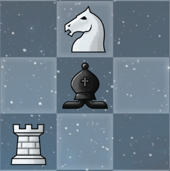
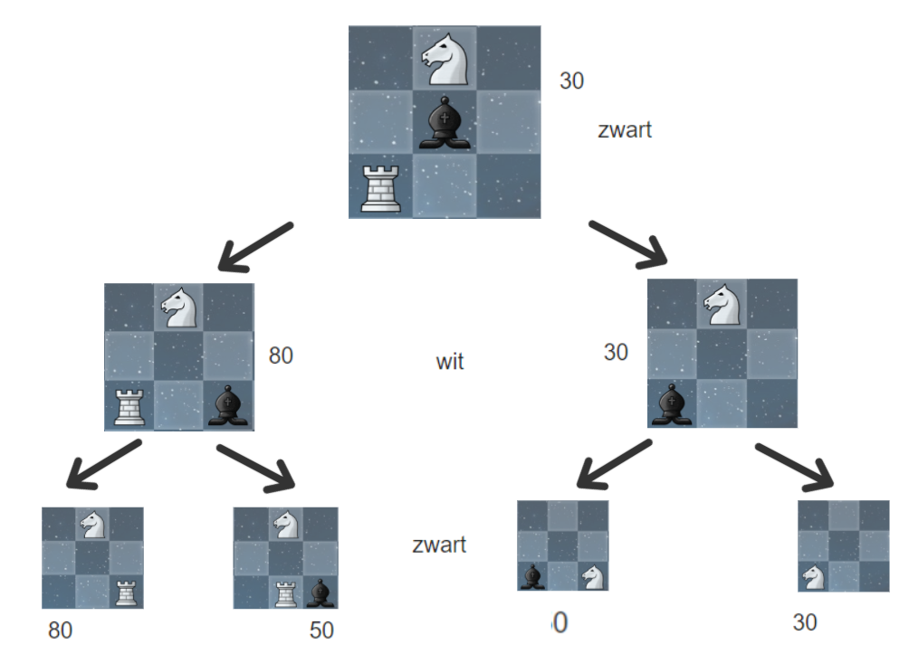
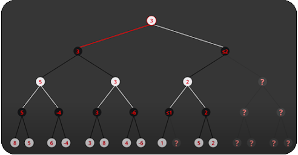

# Chess AI
## Introductie
De laatste tijd ben ik (samen met veel anderen) gefascineerd door schaken. Hierdoor ben ik mezelf wat schaakstrategieën beginnen aanleren waardoor ik kennis heb gemaakt met de schaak-engine Stockfish.

Ik begon geïntrigeerd te geraken door de werking van zo'n schaak-engine, dus ben ik wat opzoekwerk gaan uitvoeren. Het leek mij interessant om zelf op lange termijn een schaak-engine te schrijven. Maar eerst moest ik beginnen met een iets realistischer doel dan meteen een neuraal net te coderen, namelijk een schaak-AI maken met het gebruik van het Minimax algoritme en Alpha-Beta pruning.

## Minimax
Minimax is een zoek-algoritme die het programma toelaat om naar toekomstige situaties te kijken om te beslissen welke stappen die moet ondernemen die uiteindelijk het meeste in zijn voordeel zijn.

Dit algoritme werkt op basis van een vooraf bepaalde diepte zodat het programma weet hoe ver in de toekomst er gekeken moet worden.

Je kan dit visueel voorstellen als een search tree waarbij elke node een schaakpositie is. Om het simpel te houden, ga ik het voorstellen met een binary search tree.

We beginnen bij de root node, wat de huidige positie voorstelt:

Stel onze AI speelt met de zwarte stukken en het is nu aan de AI om te spelen. Om die een beslissing te laten maken, gaan we het Minimax algoritme oproepen met de huidige positie en een bepaalde diepte.

We zullen hier als diepte 2 nemen. Dit betekent dus dat de AI 2 stappen vooruit in de toekomst zal gaan kijken. Eens de diepte bereikt hebben, gaan we alle posities tot die diepte evalueren op basis van een evaluatie-functie, bv. de mogelijkheid om de tegenstander zijn stukken te nemen.

Zwart heeft vanuit de huidige positie verschillende opties:

Het eerste dat er gebeurt is de linkse kant van de tree traverseren tot we de opgegeven diepte behaald hebben (2). Eens we de diepte behaald hebben, gaan we alle mogelijke posities evalueren. Dit doe ik door het totaal van de zwarte score af te trekken van het totaal van de witte score. (de score van een kleur is het totaal van de waardes van de overblijvende stukken) 

Elk stuk heeft een vaste waarde: pion 10, paard en loper 30, toren 50, koningin 90 en koning 900.

Als de evaluatie-functie een negatieve waarde returned, betekent dat dat zwart (minimizing player) in het voordeel is. Een positieve waarde betekent dan dat wit in het voordeel is. Dus als we op een laag zijn waar het aan wit is om te bewegen, gaat wit de meest positieve evaluatie kiezen. Als het aan zwart is, gaat zwart de meest negatieve evaluatie kiezen.

Eens we alle posities in de tree hebben geëvalueerd, gaan we dus onze AI de positie laten kiezen die voor hem het meeste voordelig is. (in onze situatie is de AI zwart dus die gaat de meest negatieve evaluatie kiezen). Dat is het Minimax algoritme.

## Alpha-Beta pruning
Alpha-Beta pruning is het niet evalueren van bepaalde nodes in de tree waardoor het Minimax algoritme sneller zal verlopen.

Bron: https://www.youtube.com/watch?v=l-hh51ncgDI

Dit niet evalueren van bepaalde nodes gebeurt als we al op voorhand weten dat de waarde van die nodes uiteindelijk toch niet gekozen zal worden door het Minimax algoritme, dus kunnen we die weglaten AKA “prunen”.

## Implementatie
Voor de implementatie van het Minimax algoritme heb ik een functie aangemaakt waarvan de belangrijkste parameters zijn:
  - De huidige positie op het bord
  - Diepte
  - Bool: maximizingPlayer

Bij de eerste call van de Minimax-functie geven we als argumenten de member variabele m_Depth mee om te diepte bij te houden en false voor de maximizingPlayer bool omdat de AI met zwart speelt en zwart de minimizing player is.

In deze functie check ik eerst of de diepte 0 is of het spel gedaan is zodat we weten of we nog verder in de tree moeten traverseren of niet. Als de diepte 0 is of het spel gedaan is, return ik de evaluatie van die node.

Als de opgegeven diepte nog niet behaald is, gaan we checken of het aan de minimizing player (zwart) of aan de maximizing player (wit) is op basis van de maximizingPlayer bool.

### Minimizing player
Als het aan de minimizing player is (zwart), gaan we op zoek naar de meest negatieve evaluatie die verkregen kan worden vanuit de huidige positie.

Ik heb in de code voor zwart eerst een lokale variabele gemaakt, minEvaluation, waarin we de waarde bijhouden van de meest negatieve evaluatie.

Hierna loopen we over alle mogelijk moves die zwart kan zetten vanuit de huidige positie en gaan we voor elke move recursief de Minimax-functie oproepen. Aan deze functie call geven we als argumenten telkens de diepte-1 mee en true als maximizingPlayer bool omdat het na deze functie call aan wit is om een move te zetten.

Het resultaat van deze functie call steken we in een andere lokale variabele, currentEvaluation.

Hierna zetten we de minEvaluation variabele op de laagste waarde tussen minEvaluation en currentEvaluation. (std::min)

Eens we alle moves hebben geëvalueerd, returnen we minEvaluation.

### Maximizing player
Als het aan de maximizing player is (wit), gaan we op zoek naar meest positieve evaluatie die verkregen kan worden vanuit de huidige positie.

In deze situatie gaan we hetzelfde doen als voor zwart, maar in plaats van de meest negatieve evaluatie, gaan we de meest positieve evaluatie bijhouden in een lokale variabele, maxEvaluation.

Die gaan we na elke functie call zetten op de hoogste waarde tussen maxEvaluation en currentEvaluation. (std::max)

### Beste move
We houden ook de beste move voor zwart bij zodat we die kunnen toepassen op het échte bord als we terug in de eerste call van de Minimax-functie komen.

## Resultaat
Hoe de AI nu geïmplementeerd is, werkt die nog vrij simplistisch aangezien die enkel moves evalueert op basis van de mogelijkheid om andere stukken te kunnen nemen.

Dit kan verbeterd worden door het score-systeem van het spel aan te passen. (bv. Doubled pawns, stukken ontwikkelen, castling, center control,..)

## Conclusie
Hoe primitief de AI ook lijkt, ik ben heel blij dat die effectief werkt en dat je ertegen kan spelen. (en in de meeste gevallen kan winnen)

Dit was een goed begin om meer inzicht te verwerven over de complexiteit van een schaak AI/engine.

Nu ben ik van plan om me eerst verder te verdiepen in literatuur over neurale netwerken en genetische algoritmes met als doel uiteindelijk zelf een schaak-engine te kunnen schrijven die autonoom kan leren om beter te worden.
